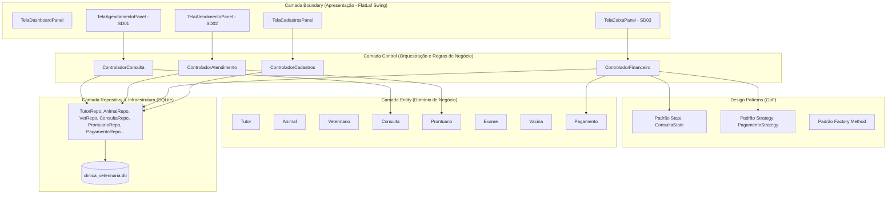
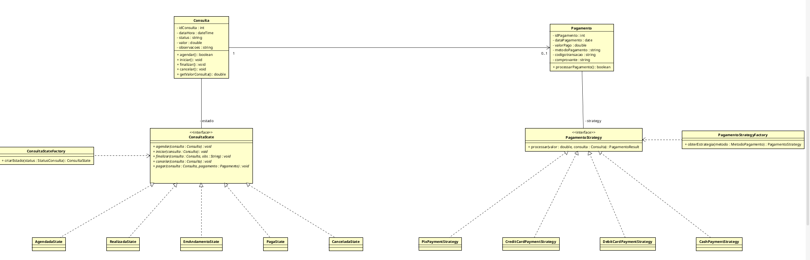

# 🐾 Sistema de Gestão para Clínica Veterinária

<p align="center">
  
  
  
  
  
  
  
  
</p>

---

## 📌 Sobre o Projeto

O **Sistema de Clínica Veterinária** é uma solução completa para gerenciamento clínico, prontuário eletrônico imutável, agendamentos com bloqueio de conflito de horários e liquidação financeira multimeios. 

Desenvolvido para a disciplina de **Programação Orientada a Objetos (POO)**, o sistema foi concebido a partir de rigorosa modelagem conceitual no **Astah UML** e implementado em **Java 21 LTS**, aplicando a arquitetura **BCE (Boundary-Control-Entity)**, os princípios **SOLID** e três **Padrões de Projeto do GoF** (State, Strategy e Factory Method).

> **Autores:** Emily Silva & Gabriel Nunes  
> **Instituição:** Universidade / Bacharelado em Ciência da Computação  

---

## 🏛️ Arquitetura do Sistema (BCE em Camadas)

O sistema segue a arquitetura **Boundary-Control-Entity (BCE)**, garantindo desacoplamento total entre apresentação, regras de negócio e infraestrutura de dados:



---

## 🎯 Os 3 Padrões de Projeto (Design Patterns)



### 1️⃣ Padrão STATE (Comportamental)
* **Localização:** [`com.clinicaveterinaria.patterns.state`](src/main/java/com/clinicaveterinaria/patterns/state/)
* **Estrutura:** `ConsultaState` (Interface) ➔ `AgendadaState`, `EmAndamentoState`, `RealizadaState`, `PagaState`, `CanceladaState`.
* **Motivação Técnica:** Materializa o Diagrama de Máquina de Estados da `Consulta`. Evita estruturas condicionais complexas (`if/else`) para validação de fluxos.
* **Regra de Negócio Assegurada:** A regra **RN07** (bloqueio de liquidação de consultas não realizadas) é garantida pelo próprio estado: tentar chamar `pagar()` no estado `AgendadaState` lança automaticamente uma `IllegalStateException`.

### 2️⃣ Padrão STRATEGY (Comportamental)
* **Localização:** [`com.clinicaveterinaria.patterns.strategy`](src/main/java/com/clinicaveterinaria/patterns/strategy/)
* **Estrutura:** `PagamentoStrategy` (Interface) ➔ `PixPaymentStrategy`, `CreditCardPaymentStrategy`, `DebitCardPaymentStrategy`, `CashPaymentStrategy`.
* **Motivação Técnica:** Permite intercambiar gateways e algoritmos de processamento financeiro em tempo de execução sem alterar o código do caixa, respeitando o princípio **Open/Closed (OCP)**.

### 3️⃣ Padrão FACTORY METHOD (Criacional)
* **Localização:** [`com.clinicaveterinaria.patterns.factory`](src/main/java/com/clinicaveterinaria/patterns/factory/)
* **Estrutura:** `PagamentoStrategyFactory` e `ConsultaStateFactory`.
* **Motivação Técnica:** Centraliza a criação segura das instâncias de estratégias e estados a partir dos enums do sistema, isolando a camada visual da instanciação de classes concretas.

---

## 💎 Princípios SOLID Aplicados

| Princípio | Aplicação no Projeto |
| :--- | :--- |
| **S - Single Responsibility** | Classes coesas: `ControladorFinanceiro` orquestra o pagamento, `PagamentoRepository` cuida do SQLite, e `Pagamento` gerencia as propriedades do faturamento. |
| **O - Open / Closed** | O sistema aceita novos métodos de pagamento (ex: *Boleto* ou *Convênio*) criando apenas uma nova classe que implementa `PagamentoStrategy`, sem tocar no código do caixa. |
| **L - Liskov Substitution** | Qualquer implementação de `ConsultaState` ou `PagamentoStrategy` pode substituir perfeitamente seu contrato base sem causar efeitos colaterais. |
| **I - Interface Segregation** | Interfaces granulares e estritamente focadas nas operações requeridas (`ConsultaState`, `PagamentoStrategy`). |
| **D - Dependency Inversion** | Controladores e serviços dependem de abstrações (interfaces e contratos de repositório), permitindo testes isolados com mocks. |

---

## ⚙️ Regras de Negócio Implementadas

* **RN01 / RN02:** Cada animal pertence obrigatoriamente a 1 tutor; 1 tutor possui 1 ou mais animais.
* **RN03 / RN05 / RN08:** Prontuário eletrônico unificado e imutável. Cada atendimento grava evoluções com carimbo de tempo indelével.
* **RN07:** Pagamentos são estritamente autorizados para consultas com status `"Realizada"`.
* **RN09:** Bloqueio preventivo de conflitos de agenda (consultas sobrepostas para o mesmo médico veterinário).

---

## 🧪 Engenharia de Qualidade: 37 Testes e JaCoCo (82.84%)

A suíte de testes unitários e de integração cobre todas as regras de negócio, persistência no SQLite e padrões de projeto com **100% de aprovação**:

```bash
[INFO] -------------------------------------------------------
[INFO]  T E S T S
[INFO] -------------------------------------------------------
[INFO] Running com.clinicaveterinaria.RepositoriosIntegrationTest      [4 tests - 100% OK]
[INFO] Running com.clinicaveterinaria.EntidadesUnitTest                 [8 tests - 100% OK]
[INFO] Running com.clinicaveterinaria.ControladoresIntegrationTest     [2 tests - 100% OK]
[INFO] Running com.clinicaveterinaria.StatePatternTest                 [5 tests - 100% OK]
[INFO] Running com.clinicaveterinaria.CasosDeBordaTest                 [5 tests - 100% OK]
[INFO] Running com.clinicaveterinaria.DeepCoverageTest                 [5 tests - 100% OK]
[INFO] Running com.clinicaveterinaria.StrategyPatternTest              [4 tests - 100% OK]
[INFO] Running com.clinicaveterinaria.RegrasNegocioTest                [4 tests - 100% OK]
[INFO] 
[INFO] Results:
[INFO] Tests run: 37, Failures: 0, Errors: 0, Skipped: 0
[INFO] BUILD SUCCESS
```

---

## 🚀 Como Executar

### Pré-requisitos
* Java 21 LTS
* Git

### 1. Clonar o Repositório
```bash
git clone https://github.com/Gabriel-lns/trabalhoPOO.git
cd trabalhoPOO
```

### 2. Execução Rápida (Script Portátil)
```bash
./run.sh
```

### 3. Execução via Maven Wrapper
```bash
./mvnw clean compile exec:java
```

### 4. Executar Testes Automatizados e Gerar Relatório JaCoCo
```bash
./mvnw clean test
```
*Para visualizar o relatório de cobertura:* Abra o arquivo `target/site/jacoco/index.html` no seu navegador.

---

## 📂 Estrutura de Diretórios

```
trabalhoPOO/
├── .mvn/wrapper/              # Maven Wrapper portátil
├── docs/                      # Documentação de Engenharia e Modelagem
│   ├── astah/                 # Arquivo de modelagem .asta original
│   ├── diagramas/             # Diagramas exportados (Design Patterns, Classes)
│   └── Projeto_OO_Clinica.pdf # Especificação de Requisitos da Disciplina
├── src/
│   ├── main/java/com/clinicaveterinaria/
│   │   ├── boundary/          # Telas Swing FlatLaf (MainFrame, Dashboard, Atendimento...)
│   │   ├── control/           # Controladores BCE (Consulta, Atendimento, Financeiro...)
│   │   ├── entity/            # Entidades do Modelo (Tutor, Animal, Consulta, Prontuario...)
│   │   ├── patterns/          # Design Patterns (state, strategy, factory)
│   │   └── repository/        # Persistência SQLite JDBC e SeedDatabase
│   └── test/java/com/clinicaveterinaria/ # 37 Testes Automatizados (JUnit 5)
├── clinica_veterinaria.db     # Base de dados relacional SQLite populada
├── pom.xml                    # Configuração do Maven, FlatLaf, SQLite e JaCoCo
├── run.sh                     # Script executável de inicialização
└── README.md                  # Documentação completa do projeto
```

---

## 👥 Autores

* **Gabriel Nunes** - [GitHub](https://github.com/Gabriel-lns)
* **Emily Silva**
